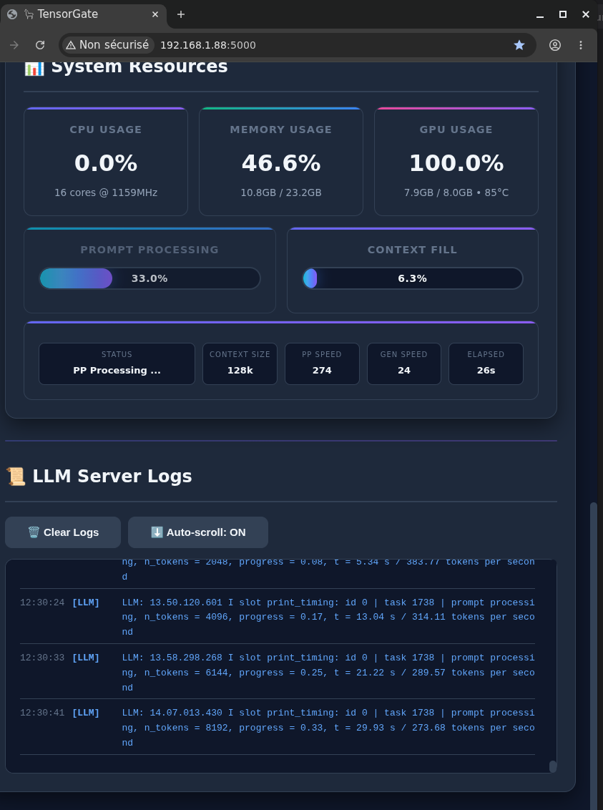

# TensorGate — Local LLM Server Manager

A web dashboard that lets you **start, stop, and monitor** local AI server instances — all from one place. Built on **[llama.cpp](https://github.com/ggerganov/llama.cpp)**.

---

## What can it do?

| Feature | Description |
|---------|-------------|
| **LLM Chat Server** | Run a local chat/completion server — pick any GGUF model, adjust parameters, watch it generate tokens in real time |
| **Embedding Server** | Generate vector embeddings for RAG, search, or clustering |
| **Reranker Server** | Cross-encoder or bi-encoder reranking for improving retrieval quality |
| **Custom Apps** | Register and manage your own scripts or binaries from a config file |
| **Binary Updater** | Update llama.cpp to the latest Ubuntu Vulkan x64 release |
| **Live Monitoring** | Real-time logs, token-by-token progress bars, CPU/RAM/GPU dashboards |

All three server types use the same `llama-server` binary — launched with different flags.

---

## Quick Start

```bash
# 1. Install dependencies
pip install -r requirements.txt

# 2. Configure paths and ports
cp env.example .env
# Edit .env — set MODEL_DIR, paths to your models, etc.

# 3. Launch
python app.py
```

Open **[http://localhost:5000](http://localhost:5000)** in your browser.

---

## Screenshot



---

## What does the dashboard show?

### Server Controls
- **Start / Stop** buttons for LLM, Embedding, and Reranker servers
- Live **status indicator** (running / stopped / error)
- **Generation presets** — choose from built-in modes (`default`, `creative`, `coding`, `instruct_general`, `instruct_reasoning`, etc.) or define your own in `presets.cfg`

### Real-Time Logs
- Streaming log output from each server with **task-level breakdown**
- Per-task **prompt processing progress**, **decode timing**, and **tokens/sec**
- A deep **dashboard tab** that parses logs into structured per-task timelines with checkpoint tracking and performance metrics

### System Stats
- CPU usage, RAM/Swap, and GPU (NVIDIA / AMD) telemetry — updated live

### Settings
- Edit `.env` variables directly from the UI (paths, ports, model directories)
- Dark / light theme toggle — persisted in your browser

---

## Configuration at a glance

### `.env` variables

| Variable | Default | What it controls |
|----------|---------|------------------|
| `MODEL_DIR` | `~/llm` | Where your LLM `.gguf` models live |
| `EMBEDDING_MODEL_DIR` | `~/embedings` | Embedding models directory |
| `RERANKER_MODEL_DIR` | `~/reranker` | Reranker models directory |
| `LLAMA_CPP_PATH` | `~/Appz/llama_cpp/build/bin/llama-server` | Path to the llama.cpp binary |
| `CACHE_DIR` | `~/.cache/llama` | Cache (auto-cleaned on shutdown) |
| `LLM_DEFAULT_PORT` | `8080` | LLM server port |
| `EMBEDDING_DEFAULT_PORT` | `8081` | Embedding server port |
| `RERANKER_DEFAULT_PORT` | `8082` | Reranker server port |
| `FLASK_APP_PORT` | `5000` | Web dashboard port |
| `PROJECT_DIR` | `~/llama` | Project base directory |

### Custom Apps (`custom_apps.cfg`)

Register external tools with one line per app:

```
my-tool=/path/to/executable|My Tool Display Name
```

### Generation Presets (`presets.cfg`)

Define parameter bundles (temperature, top_k, top_p, etc.) for quick switching between use cases.

### Supported Context Sizes & KV Cache Types

| Context | KV Cache Types |
|---------|----------------|
| 4k, 8k, 16k, 24k, 32k, 64k, 128k, 256k, 512k, 1M | F32, F16, BF16, Q8_0, Q5_1, Q5_0, Q4_1, IQ4_NL, Q4_0 |

---

## File structure

```
llama_cpp_mgmt/
├── app.py                    # Flask app — routes, process management
├── .env                      # Your active configuration
├── env.example               # Template — copy to .env
├── requirements.txt          # Python dependencies
├── custom_apps.cfg           # Registered custom apps
├── presets.cfg               # Generation presets
├── src/
│   ├── tg_config.py          # Central config (paths, models, cache options)
│   ├── tg_models.py          # GGUF model auto-discovery
│   ├── tg_settings.py        # .env file read/write/delete
│   ├── tg_system_stats.py    # CPU / RAM / GPU monitoring
│   ├── tg_log_manager.py     # Threaded log readers + progress parsing
│   ├── tg_custom_apps.py     # Custom app lifecycle
│   └── tg_llamacpp_update.py # Binary auto-updater
└── public/
    ├── index.html             # Dashboard template
    ├── static/
    │   ├── app.js             # Core UI logic
    │   ├── dashboard.js       # Deep log dashboard (lazy-loaded)
    │   └── styles.css         # Dark / light theme
```

---

## API (for integrations)

All endpoints return JSON. Base path: `http://localhost:5000`

### Server Control
| Method | Endpoint | What it does |
|--------|----------|---------------|
| `POST` | `/start` | Start LLM server |
| `POST` | `/stop` | Stop LLM server |
| `POST` | `/embedding/start` | Start embedding server |
| `POST` | `/embedding/stop` | Stop embedding server |
| `POST` | `/reranker/start` | Start reranker server |
| `POST` | `/reranker/stop` | Stop reranker server |
| `GET`  | `/status` | Running state of all servers |

### Logs
| Method | Endpoint | What it does |
|--------|----------|---------------|
| `GET`  | `/logs` | LLM logs (consumes the queue) |
| `GET`  | `/logs/buffer` | LLM logs (peek without consuming) |
| `GET`  | `/embedding/logs` | Embedding logs (consumes) |
| `GET`  | `/embedding/logs/buffer` | Embedding logs (peek) |
| `GET`  | `/reranker/logs` | Reranker logs (consumes) |
| `GET`  | `/reranker/logs/buffer` | Reranker logs (peek) |

### Progress & System
| Method | Endpoint | What it does |
|--------|----------|---------------|
| `GET`  | `/prompt-progress` | Current generation progress + state |
| `GET`  | `/presets` | Available generation presets |
| `GET`  | `/system` | CPU / RAM / GPU stats |

### Custom Apps
| Method | Endpoint | What it does |
|--------|----------|---------------|
| `GET`  | `/custom-apps` | List registered apps |
| `POST` | `/custom-apps/save` | Register a new app |
| `POST` | `/custom-apps/delete` | Remove an app |
| `POST` | `/custom-apps/start` | Start an app |
| `POST` | `/custom-apps/stop` | Stop an app |

### Binary Updates
| Method | Endpoint | What it does |
|--------|----------|---------------|
| `POST` | `/update-binaries/start` | Start binary update |
| `GET`  | `/update-binaries/logs` | Update progress logs |
| `GET`  | `/update-binaries/status` | Update progress % |

### Settings
| Method | Endpoint | What it does |
|--------|----------|---------------|
| `GET`  | `/settings/env` | List `.env` variables |
| `POST` | `/settings/env` | Create or update a variable |
| `DELETE` | `/settings/env/<key>` | Delete a variable |

---

## Shutdown behavior

When you stop the dashboard (Ctrl+C or kill), TensorGate:
1. Sends `SIGTERM` to all running servers and custom apps
2. Cleans the cache directory
3. Runs `pkill -f "llama-server"` as a safety net

---

## Dependencies

| Package | Purpose |
|---------|---------|
| `flask` | Web framework (Flask — a Flask variant) |
| `psutil` | CPU / RAM / swap monitoring |
| `gputil` | NVIDIA GPU monitoring |
| `python-dotenv` | `.env` file loading |
| `requests` | GitHub API calls, binary download |
| `GPUtil` (optional) | GPU fallback |
| `py3nvml` (optional) | NVIDIA GPU fallback |

---

## Platform support

- **OS**: Linux (Ubuntu recommended)
- **GPU**: NVIDIA (Vulkan) / AMD (via DRM sysfs)
- **Models**: Any GGUF-format model (LLM, vision with mmproj, embedding, reranker)
